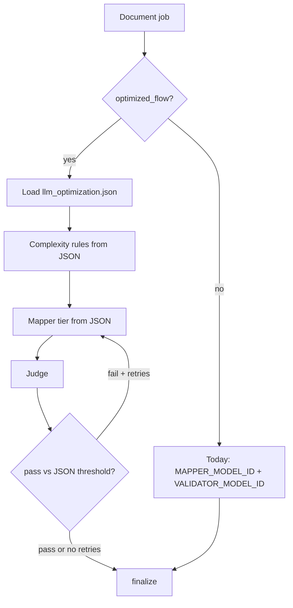
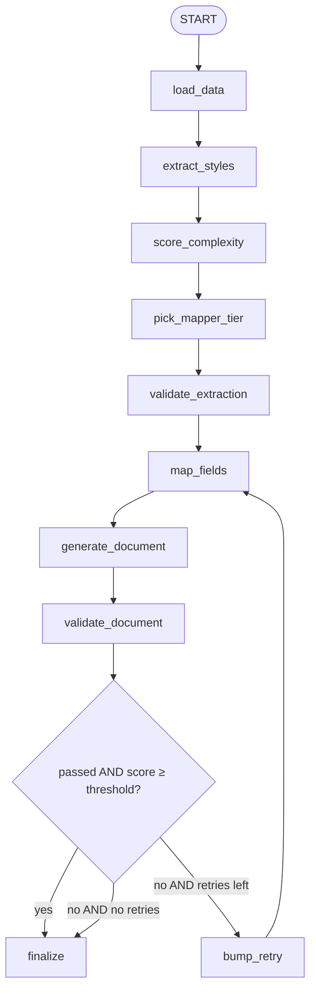

# Document LLM optimisation (complexity + retry cascade)

**Status:** implemented. Opt-in. Off (default) keeps today’s single `MAPPER_MODEL_ID` / `VALIDATOR_MODEL_ID` path.

When it is **on**, load [document-processing-mcp/config/llm_optimization.json](../document-processing-mcp/config/llm_optimization.json) (or `DOCUMENT_LLM_OPTIMIZATION_CONFIG`). That file is the source of truth for buckets, model ids, retries, and extra skips.

Related: [TOKEN_CONSUMPTION.md](TOKEN_CONSUMPTION.md), [INTERVIEW_LANGGRAPH.md](INTERVIEW_LANGGRAPH.md), judge retry env in [LOCAL_AND_CLOUD_STORAGE.md](LOCAL_AND_CLOUD_STORAGE.md).

---

## On / off

| How | Off (default) | On |
|---|---|---|
| API form | omit or `optimized_flow=false` | `optimized_flow=true` |
| UI | checkbox off | “Optimized flow” checked |
| Env | `DOCUMENT_LLM_OPTIMIZATION_ENABLED` unset/false | `true` (all jobs unless the request sets false) |
| Config file | not read | `DOCUMENT_LLM_OPTIMIZATION_CONFIG` (default: `document-processing-mcp/config/llm_optimization.json`) |

Precedence: request `optimized_flow` → else env. The JSON `enabled_by_default` field stays `false` and does **not** turn the feature on by itself.

---

## JSON config (used only when on)

Edit [llm_optimization.json](../document-processing-mcp/config/llm_optimization.json) in place, or point `DOCUMENT_LLM_OPTIMIZATION_CONFIG` at another file.

| Block | Purpose |
|---|---|
| `enabled_by_default` | Must stay `false` so stock installs keep the current flow |
| `complexity` | Easy vs hard rules (placeholders, `%`, tables). `use_json_byte_size: false` on purpose |
| `models` | `mapper_easy` / `mapper_hard` / `mapper_retry` / `mapper_final`; `validator` (+ optional `validator_retry`) |
| `retries` | `max_retries`, `validation_threshold` for this flow only (used when the request omits those fields) |
| `extras` | Skip extraction critic on easy; leftover regex before judge |

Unset model ids fall back to the previous tier, then to `MAPPER_MODEL_ID` / `VALIDATOR_MODEL_ID`.

---

## Why not JSON volume alone?

The mapper already **samples** arrays (`_n` / `_keys` / `_sample`). A bulky product list does not mean a bulky prompt. A **small** GPO JSON with many `<XX>%` / duplicate placeholders is harder than a **large** simple invoice.

`use_json_byte_size` stays `false`.

---

## A′ + B

| Approach | What it does |
|---|---|
| **A′. Pre-pick from complexity** | Rules in `complexity` |
| **B. Escalate on judge fail** | Stronger mapper only if score is below `retries.validation_threshold` |

Do **not** run small + mid + strong on every job. Do **not** add a router LLM.

---

## Graph (optimized flow only)

| Attempt | When | Field |
|---|---|---|
| 0, easy | complexity = easy | `models.mapper_easy` |
| 0, hard | complexity = hard | `models.mapper_hard` |
| 1 | judge failed | `models.mapper_retry` |
| 2 | still failed | `models.mapper_final` |
