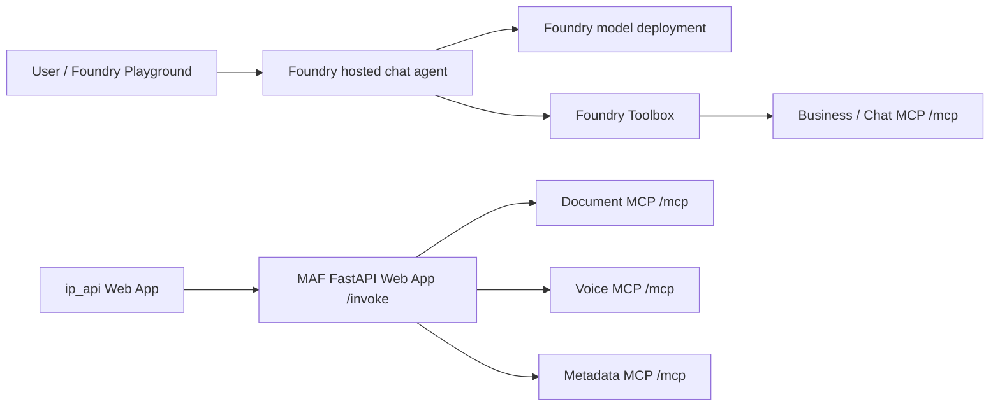

# Foundry-hosted chat agent deployment runbook

This runbook deploys `central-agentic-flow` as a Microsoft Foundry hosted
agent using the Responses protocol. For the full five-Web-App deployment, see
[AZURE_DEPLOY_MAF.md](AZURE_DEPLOY_MAF.md).

## Chat and jobs are segregated



Two paths, no overlap:

| Path | Endpoint | MCPs reachable | Registry mode |
|---|---|---|---|
| Chat | Foundry `/responses`, Web App `POST /ask` | business, optional chat | `modes: [ask]` |
| Jobs | Web App `POST /invoke` | document, voice, optional metadata | `modes: [jobs]` |

The LLM can never call document generation, voice contracts, or metadata
extraction: those servers are declared `modes: [jobs]` in
`central-agentic-flow/config/mcp_registry.yml`, so they are not passed to the
model as tools on either chat host. Job submission stays deterministic — the
caller names the server and tool explicitly.

Do not configure `ip_api.MAF_BASE_URL` with the Foundry Responses endpoint; it
serves chat only and has no `/invoke`.

## Optional ask-mode MCPs

Business (`BUSINESS_MCP_URL`) and chat (`CHAT_MCP_END_POINT` / `CHAT_MCP_URL`)
are siblings. Either or both activate when the URL is set on the Web App, or
when `TOOLBOX_ENDPOINT` is set for the Foundry agent (add each ask MCP in
`toolbox.yaml`). Until then both chat hosts start normally and answer without
tools, and they are instructed to redirect document, voice, and metadata
requests to the API.

Metadata (`METADATA_EXTRACTION_END_POINT`) is jobs-only. Do **not** put it on
the Foundry Toolbox. How to attach both slots:
[ADD_MAF_MCP_AGENTS.md](ADD_MAF_MCP_AGENTS.md).

## Deployment files

| File | Purpose |
|------|---------|
| `azure.yaml` | Foundry project, model, hosted agent and Responses protocol |
| `central-agentic-flow/foundry_main.py` | Foundry process entry point |
| `central-agentic-flow/src/central_agentic_flow/foundry_server.py` | Agent, model and optional Toolbox wiring |
| `central-agentic-flow/toolbox.yaml` | Business MCP definition (chat tools only) |
| `central-agentic-flow/.agentignore` | Files excluded from direct-code deployment |

## Prerequisites

- Azure subscription with permission to create/use a Foundry project.
- Azure CLI authenticated with `az login`.
- Azure Developer CLI authenticated with `azd auth login`.
- `azure.ai.agents` azd extension.
- Model quota in the selected Azure region.
- A business MCP on a reachable HTTPS `/mcp` URL, if you want chat tools. The
  document and voice MCPs are not needed here — they belong to the job path.

Install the Foundry extension:

```bash
azd extension install azure.ai.agents
```

Run the remaining commands from the repository root unless stated otherwise.

## 1. Configure the MCP Toolbox

Skip this whole section if you have no business MCP yet: leave
`TOOLBOX_ENDPOINT` unset and the agent runs tool-less.

Otherwise edit `central-agentic-flow/toolbox.yaml` and replace:

```text
https://REPLACE-BUSINESS-MCP.azurewebsites.net/mcp
```

Use an HTTPS endpoint, never `localhost`. Public unauthenticated MCP endpoints
should only be used for demonstrations. Do not add the document or voice MCPs
here — that would put job tools back into the chat path.

Create the Toolbox:

```bash
cd central-agentic-flow
AZURE_DEV_USER_AGENT=microsoft_foundry_skill \
  azd ai toolbox create agent-tools --from-file ./toolbox.yaml
cd ..
```

Save the versioned endpoint returned by the command:

```bash
AZURE_DEV_USER_AGENT=microsoft_foundry_skill \
  azd env set TOOLBOX_ENDPOINT "<versioned-toolbox-mcp-endpoint>"
```

## 2. Configure Azure

Create/select an azd environment:

```bash
AZURE_DEV_USER_AGENT=microsoft_foundry_skill azd env new dev
AZURE_DEV_USER_AGENT=microsoft_foundry_skill \
  azd env set AZURE_SUBSCRIPTION_ID "<subscription-id>"
AZURE_DEV_USER_AGENT=microsoft_foundry_skill \
  azd env set AZURE_LOCATION "<region>"
AZURE_DEV_USER_AGENT=microsoft_foundry_skill \
  azd env set AZURE_AI_MODEL_DEPLOYMENT_NAME "gpt-4.1-mini"
```

For an existing Foundry project, additionally configure:

```bash
AZURE_DEV_USER_AGENT=microsoft_foundry_skill \
  azd env set AZURE_AI_PROJECT_ENDPOINT \
  "https://<account>.services.ai.azure.com/api/projects/<project>"

AZURE_DEV_USER_AGENT=microsoft_foundry_skill \
  azd env set AZURE_AI_PROJECT_ID \
  "/subscriptions/<sub>/resourceGroups/<rg>/providers/Microsoft.CognitiveServices/accounts/<account>/projects/<project>"
```

Review the values before provisioning:

```bash
AZURE_DEV_USER_AGENT=microsoft_foundry_skill azd env get-values
```

Never commit the generated azd environment or `.env` files.

## 3. Test locally

Create `central-agentic-flow/.env`:

```dotenv
FOUNDRY_PROJECT_ENDPOINT=https://<account>.services.ai.azure.com/api/projects/<project>
AZURE_AI_MODEL_DEPLOYMENT_NAME=gpt-4.1-mini
# Optional; omit to run without tools
TOOLBOX_ENDPOINT=<versioned-toolbox-mcp-endpoint>
```

Prepare the component environment:

```bash
cd central-agentic-flow
python -m venv .venv
source .venv/bin/activate
python -m pip install uv
cd ..
```

Start the local Responses host:

```bash
AZURE_DEV_USER_AGENT=microsoft_foundry_skill \
  azd ai agent run document-maf-foundry --no-client
```

From a second terminal:

```bash
AZURE_DEV_USER_AGENT=microsoft_foundry_skill \
  azd ai agent invoke document-maf-foundry --local \
  "hello, are you up?"
```

Stop the local process after the smoke test.

## 4. Provision and deploy

For a new Foundry project, preview and provision:

```bash
AZURE_DEV_USER_AGENT=microsoft_foundry_skill \
  azd provision --preview --no-prompt
AZURE_DEV_USER_AGENT=microsoft_foundry_skill \
  azd provision --no-prompt
```

Skip provisioning when using an existing project that requires no
infrastructure changes.

Deploy the hosted agent:

```bash
AZURE_DEV_USER_AGENT=microsoft_foundry_skill \
  azd deploy document-maf-foundry --no-prompt
```

Each successful deployment creates an immutable Foundry agent version.

## 5. Verify

Check deployment status:

```bash
AZURE_DEV_USER_AGENT=microsoft_foundry_skill \
  azd ai agent show --output json
```

Expected status: `active` or `deployed`.

Run one remote smoke test:

```bash
AZURE_DEV_USER_AGENT=microsoft_foundry_skill \
  azd ai agent invoke document-maf-foundry \
  "list the tools you have access to"
```

If a business Toolbox is wired up, follow with a real business question. Toolbox
MCP tools arrive with a three-underscore prefix, so business tools appear as
`business___<tool_name>`.

Then confirm the segregation holds: ask the agent to generate a document. It
should say the request must go through the API job path rather than attempting
it, because no document tool is exposed to chat.

## Troubleshooting

- `azd: command not found`: install Azure Developer CLI.
- `missing_project_endpoint`: configure an existing project or run provision.
- `401` from Toolbox: verify agent identity and use the
  `https://ai.azure.com/.default` scope.
- Toolbox tools are missing: verify the versioned `TOOLBOX_ENDPOINT` and the
  business MCP URL in `toolbox.yaml`.
- Agent has no tools at all: expected when `TOOLBOX_ENDPOINT` is unset.
- Agent refuses document or voice work: expected. Submit those through
  `POST /invoke` on the MAF Web App.
- Model `404`: compare `AZURE_AI_MODEL_DEPLOYMENT_NAME` in `.env`, azd
  environment and `azure.yaml`.
- `session_not_ready`: wait 15–30 seconds and retry; inspect
  `azd ai agent monitor`.
- MCP connection failure: confirm each Web App is running and its `/mcp`
  endpoint is reachable from Azure.

## Rollback

Foundry deployments are versioned. Inspect available versions and reactivate
the previous working version through Foundry or the azd agent management
commands. Do not delete the MAF FastAPI Web App during rollback because
`ip_api` still depends on its `/invoke` endpoint.

## Security checklist

- Do not commit `.env`, keys, SAS tokens, project endpoints or Toolbox URLs.
- Prefer managed identity over API keys.
- Protect MCP Web Apps with authentication or private networking.
- Restrict Foundry and App Service RBAC to least privilege.
- Keep secrets in Azure Key Vault or App Service secret references.
